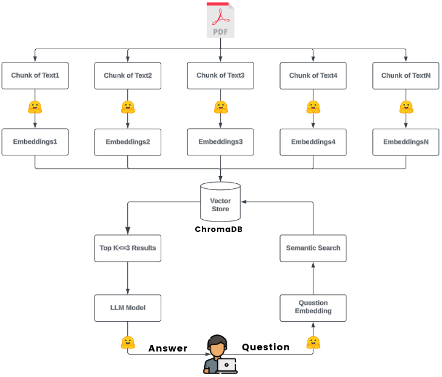

# 🤖 CopilotBot: Your AI Coding Assistant 💻
----------------------------------------------------------
### Research Paper: [github-copilot.pdf](https://raw.githubusercontent.com/goushaa/github-copilot-chatbot/main/github-copilot.pdf)
----------------------------------------------------------

## What is CopilotBot?
CopilotBot 🤖 is an intelligent assistant designed to provide detailed insights into GitHub Copilot's performance, functionality, and limitations. It enables users to ask about AI-assisted programming and receive responses based on empirical research data.

## How It Is Built?
**CopilotBot** leverages the following technologies:

- **Streamlit**: Provides a user-friendly interface for real-time interaction.
- **LangChain**: Seamlessly integrates language models (LLMs) with a vector database.
- **RecursiveCharacterTextSplitter**: Splits the research PDF into manageable chunks for effective indexing.
- **Hugging Face's sentence-transformers/all-MiniLM-L6-v2**: Generates precise embeddings for semantic understanding.
- **Chroma Vector Database**: Efficiently stores and retrieves embeddings for query handling.
- **Meta-Llama-3-8B-Instruct**: Powers natural language understanding for answering queries.
- **Custom Prompt Engineering**: Guides the model to deliver insightful and contextually accurate responses.

## Architecture Overview


## Setup and Execution

### Step 1: Install Dependencies
Run the following command to install the required libraries from the `requirements.txt` file:

```bash
pip install -r requirements.txt
```

## Step 2: Configure API Keys

Add your **HuggingFace API Token** to the `.env` file. If the file doesn’t exist in the project directory, create it and include the following line:

```bash
HUGGINGFACEHUB_API_TOKEN=<your_api_token>
```

## Step 3: Generate Vector Embeddings

Run the following script to split the research paper, generate embeddings, and store them in the vector database:

```bash
python embeddings_generator.py  
```

## Step 4: Launch CopilotBot

Start the CopilotBot Streamlit app by running:

```bash
streamlit run app.py  
```

## Differences Between Scripts

- **vector_embeddings.py**: This script is responsible for processing the research paper, generating vector embeddings, and storing them in the Chroma Vector Database. It handles the initial setup necessary for the CopilotBot to understand the content of the paper.

- **app.py**: This script launches the Streamlit application, providing the user interface through which users can interact with CopilotBot. It utilizes the embeddings generated by `vector_embeddings.py` to respond to user queries in real-time.